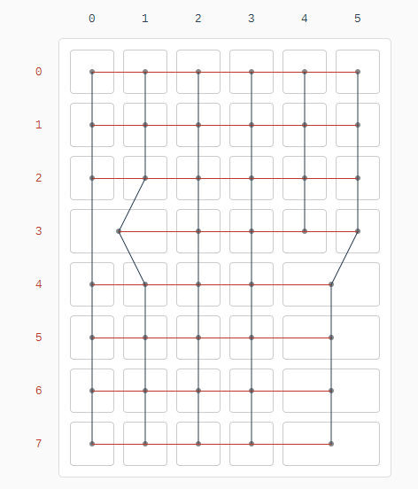

# free42
Here are the design files to make your very own hand wired Free42 calculator keyboard! ([As seen on Reddit](https://www.reddit.com/r/MechanicalKeyboards/comments/hdi7p7/hand_wired_free42_calculator_keyboard/)).

tl;dr - [keycaps](keycaps), [case](case), [firmware](firmware)

## KEYCAPS

Order your own set from [WASD Keyboards](https://www.wasdkeyboards.com)!

- $60 - [61 keycap set](https://www.wasdkeyboards.com/61-key-custom-cherry-mx-keycap-set.html), with [this template](keycaps/wasd-inkscape-61-11.13.2017%20-%20HP%2042S.svg)
- $12 - [R1 1x2.00](https://www.wasdkeyboards.com/custom-art-cherry-mx-keycaps.html), [plus](keycaps/wasd-inkscape-104-11.13.2017%20-%20HP%2042S%20-%20plus.svg)
- $12 - [R1 1x2.00](https://www.wasdkeyboards.com/custom-art-cherry-mx-keycaps.html), [minus](keycaps/wasd-inkscape-104-11.13.2017%20-%20HP%2042S%20-%20minus.svg)
- $12 - [R1 1x2.00](https://www.wasdkeyboards.com/custom-art-cherry-mx-keycaps.html), [multiply](keycaps/wasd-inkscape-104-11.13.2017%20-%20HP%2042S%20-%20multiply.svg)
- $12 - [R1 1x2.00](https://www.wasdkeyboards.com/custom-art-cherry-mx-keycaps.html), [divide](keycaps/wasd-inkscape-104-11.13.2017%20-%20HP%2042S%20-%20divide.svg)

Don't forget to set the keycap colors! All the keycaps are "charcoal", except the /? key (the one next to the right-shift), which is "orange".

## CASE

You can print your own case, using [this .stl file](case/HP%2042S%20-%20case.stl), or order one [from Shapeways](https://www.shapeways.com/product/5WRUSSCEQ/free42-hand-wired-keyboard-case).

## HARDWARE

If you're new to hand wired keyboards, matt3o wrote [a good guide](https://deskthority.net/viewtopic.php?f=7&t=6050).

For the microcontroller, I used an [Arduino Pro Micro](https://www.sparkfun.com/products/12640).

BOM:
- $25.99 - [arduino](https://www.amazon.com/gp/product/B07FXCTVQP/ref=ppx_yo_dt_b_search_asin_title?ie=UTF8&psc=1)
- $6.27 - [usb micro extension](https://www.amazon.com/gp/product/B00D8O8YCG/ref=ppx_yo_dt_b_search_asin_title?ie=UTF8&psc=1)
- $11.45 - [connecting wire](https://www.amazon.com/gp/product/B07DYG6DVP/ref=ppx_yo_dt_b_search_asin_title?ie=UTF8&th=1)
- $14.69 - [ribbon connectors](https://www.amazon.com/gp/product/B0775WHBP5/ref=ppx_yo_dt_b_search_asin_title?ie=UTF8&psc=1)
- $5.99 - [diodes](https://www.amazon.com/gp/product/B079KJ91JZ/ref=ppx_od_dt_b_asin_title_s01?ie=UTF8&psc=1)
- $8.99 - [solder](https://www.amazon.com/gp/product/B075WB98FJ/ref=ppx_od_dt_b_asin_title_s01?ie=UTF8&th=1)
- $15.99 - [soldering iron](https://www.amazon.com/gp/product/B09J7WM6RH/ref=ppx_yo_dt_b_search_asin_title?ie=UTF8&psc=1)
- $9.99 - [rubber feet](https://www.amazon.com/gp/product/B001JAW454/ref=ppx_yo_dt_b_search_asin_title?ie=UTF8&psc=1)
- $29.99 - [key switches](https://www.amazon.com/Gateron-KS-9-Mechanical-Type-Switch/dp/B07X3SYQMV?ref_=ast_sto_dp&th=1&psc=1)
- $2.50 - 5 x [stabilizer inserts](https://www.wasdkeyboards.com/cherry-mx-keycap-stabilizer-insert-2pcs.html)
- $2.50 - 5 x [stabilizer clips](https://www.wasdkeyboards.com/cherry-mx-plate-mounted-stabilizer-clips-2pcs.html)
- $2.50 - 5 x [stabilizer springs](https://www.wasdkeyboards.com/cherry-mx-stabilizer-spring-for-2x-keycaps.html)

## FIRMWARE

You can program the Arduino with [QMK Toolbox](https://github.com/qmk/qmk_toolbox/releases), using [this .hex firmware file](firmware/layout.hex).

To create your own layout, use [the Keyboard Firmware Builder](https://kbfirmware.com/), with [this .json file](firmware/layout.json).

And here's [the default layout](http://www.keyboard-layout-editor.com/#/gists/66d7023200c0f85745199b2e1fa60b12).

## DONATIONS

Feel free to donate to *[the coffee fund](https://paypal.me/pkobayashi)* :)
